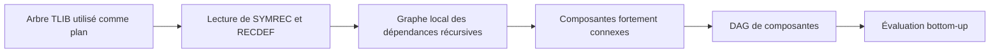
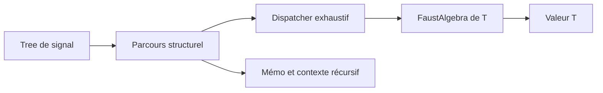

# Calcul bottom-up d’attributs sur les arbres récursifs

::: toc+
- **Objet** — définir le problème, le périmètre et les objectifs.
- **Modèle conceptuel** — séparer arbres, dépendances, algèbre, attributs et convergence.
- **Contrats génériques** — spécifier les paramètres de templates et leurs obligations.
- **Graphe de dépendances** — construire et condenser les dépendances avec DirectedGraph.
- **Algorithme d’évaluation** — calculer une fois les parties acycliques et itérer seulement dans les cycles.
- **Point fixe par encadrement** — représenter explicitement les approximations inférieure et supérieure.
- **Signature et algèbres Faust** — distinguer syntaxe libre, interprétations et sortes non signal.
- **Parcours algébrique des signaux** — définir le catamorphisme mémoïsé et sa loi de reconstruction modulo alpha-renommage.
- **API proposée** — donner une première forme d’interface C++ sans figer l’implémentation.
- **Diagnostics et terminaison** — rendre les échecs et les approximations observables.
- **Tests de conformité** — couvrir arbres partagés, récursions et politiques de convergence.
- **Migration** — introduire le mécanisme progressivement sans casser les usages existants.
- **Points à préciser** — isoler les derniers contrats qui demandent une expérimentation.
:::

## Objet

Cette spécification décrit un moteur générique de calcul d’attributs *bottom-up* sur des arbres TLIB, y compris lorsque ceux-ci représentent des définitions récursives. Le moteur associe un attribut de type `Attribute` à chaque nœud utile et calcule cet attribut à partir de ceux dont le nœud dépend.

Le moteur reçoit exclusivement des arbres récursifs en représentation symbolique. Cette restriction est un invariant de l’API, et non un détail d’implémentation : elle permet de mémoïser les attributs des termes récursifs par identité de pointeur. En représentation de de Bruijn, l’attribut d’un sous-terme non clos dépend de son contexte de liaison ; un même sous-arbre peut donc recevoir des attributs différents, ce qui interdit cette mémoïsation.

Sur une partie acyclique, chaque attribut ne doit être calculé qu’une fois. Sur une partie cyclique, les attributs doivent être réévalués jusqu’à ce qu’une politique configurable reconnaisse un point fixe ou une approximation finale sûre. La comparaison par égalité n’est pas imposée par le moteur.

Les objectifs sont les suivants :

- rendre le type d’attribut, son initialisation et sa politique de convergence paramétrables ;
- utiliser une `FaustAlgebra<Attribute>` pour l’interprétation locale des arbres de signaux ;
- préserver le partage structurel des arbres et mémoïser les résultats ;
- identifier chaque constructeur par un domaine et un opcode portés par son symbole ;
- vérifier que la signature interprétée par le fold est celle de l’algèbre ;
- identifier les composantes fortement connexes avec DirectedGraph ;
- limiter les recalculs aux nœuds réellement affectés dans une composante cyclique ;
- fournir des diagnostics précis en cas de non-convergence.

Cette première version spécifie le comportement attendu. Elle ne fixe ni le nom définitif des classes ni leur emplacement final entre `signals`, TLIB et DirectedGraph.

Ce document est le troisième étage d'une pile dont les deux premiers sont documentés côté TLIB. Le README de TLIB fixe le substrat : hash-consing à partage maximal, propriétés, récursion symbolique `SYMREC`/`RECDEF` et alpha-équivalence. REWRITE-SPEC spécifie la transformation syntaxique `Tree → Tree`, où le nouage par variable fraîche suffit à traiter la récursion sans point fixe ; ses non-objectifs — stratégie de point fixe, mémoïsation `(Tree, contexte) → résultat` — délimitent exactement le périmètre du présent document, qui commence là où le codomaine cesse d'être des arbres. Le protocole de reconstruction spécifié plus bas est la sémantique de `treeRewrite` reformulée comme algèbre ; les deux mécanismes composent en pipeline : annoter (le présent moteur), réécrire sous garde (`treeRewrite` `pre`/`post`), ré-annoter.

::: note [Portée initiale]
La première implémentation peut vivre dans la bibliothèque `signals`, où le décodage des constructeurs de signaux et `FaustAlgebra` sont disponibles. La séparation des contrats doit néanmoins permettre de migrer ensuite le moteur générique dans TLIB.
:::

## Modèle conceptuel

Le système distingue sept éléments.

Signature
:   Ensemble multisorte des constructeurs interprétés. Un domaine identifie la signature et un opcode identifie un constructeur dans ce domaine.

Algèbre syntaxique
:   Interprétation initiale qui reconstruit les termes libres de la signature. Pour les signaux, son résultat est un `Tree`.

Attribut
:   Valeur calculée pour un nœud. Exemples : intervalle, type, coût, ensemble de variables libres ou propriété de causalité.

Algèbre d’interprétation
:   Sémantique locale d’un constructeur. Elle produit le candidat d’un nœud à partir des attributs de ses dépendances.

Résolveur de dépendances
:   Traduit les nœuds symboliques récursifs de TLIB et leurs définitions en un graphe explicite de dépendances entre unités de calcul.

Politique de point fixe
:   Fournit les valeurs initiales et décide quand le candidat courant termine l’itération.

Ordonnanceur
:   Condense le graphe en composantes fortement connexes, évalue le DAG résultant dans l’ordre bottom-up et pilote une file de travail à l’intérieur des cycles.

```adt
AttributeState ::= Unknown
                 | Known(Attribute)

Component ::= Acyclic(Node)
            | Cyclic(Set(Node))

Step ::= Candidate(Attribute)
       | Stable(Attribute)
       | Changed(Attribute)
```

Pour un nœud $n$ de constructeur $op$ et de dépendances $d_1, …, d_k$, le candidat est :

```math
c_n = \mathrm{op}_{\mathrm{Algebra}}(a_{d_1}, …, a_{d_k})
```

La composante est stable lorsque la politique accepte toutes les transitions pertinentes entre l’attribut précédent et ce candidat :

```math
\mathrm{Reached}(n, a_n, a'_n, \gamma_n)
```

Pour la partie inductive de la syntaxe, chaque algèbre `A` induit un catamorphisme unique :

```math
Fold_A(op(s_1, …, s_k)) = A.op(Fold_A(s_1), …, Fold_A(s_k))
```

La récursion enrichit ce schéma d’un protocole de point fixe. L’algèbre syntaxique reconstruit la liaison sans itération ; une algèbre d’attributs résout les dépendances cycliques dans son domaine abstrait.

## Contrats génériques

### Type d’attribut

`Attribute` est un paramètre de template. Le moteur ne doit exiger implicitement ni constructeur par défaut, ni `operator==`, ni ordre total. Les opérations nécessaires sont fournies par les autres politiques.

Un attribut doit être copiable ou déplaçable selon le mode de stockage retenu. Une implémentation peut permettre des attributs immuables et partagés, par exemple `std::shared_ptr<const T>`, sans modifier l’algorithme.

### Algèbre locale

L’algèbre reçoit un nœud et les attributs déjà publiés de ses dépendances. Dans la spécialisation signaux, le décodage du nœud appelle l’opération correspondante de `FaustAlgebra<Attribute>`.

L’algèbre doit être déterministe relativement à ses arguments et à son contexte explicite. Elle ne décide ni de l’ordre global d’évaluation ni de la terminaison du point fixe.

### Initialisation

Une politique fournit la valeur initiale de chaque variable appartenant à une composante cyclique. Cette valeur peut dépendre du nœud et du contexte : élément bottom d’un treillis, intervalle maximal, type provisoire ou valeur définie par l’appelant.

Les nœuds acycliques n’ont pas besoin d’une valeur initiale : leur attribut est directement obtenu à partir de dépendances déjà calculées.

### Prédicat d’arrêt

Le prédicat reçoit au minimum la valeur précédente et la valeur courante. Il peut aussi consulter le nœud, le numéro d’itération, la phase et un état propre à la politique.

Il ne faut pas imposer `previous == current`. Un prédicat peut reconnaître une équivalence abstraite, une inclusion, une précision suffisante, une tolérance numérique ou l’épuisement d’un budget porté par l’attribut.

## Graphe de dépendances

### Orientation

Une arête `n → d` signifie que le calcul de `n` dépend de `d`. Cette convention correspond à celle de DirectedGraph et de ses `schedule`, où une dépendance doit précéder le nœud qui la consomme.

L’arbre hash-consé est le plan principal du fold : ses branches donnent les dépendances ordinaires et son identité de pointeur permet la mémoïsation. Le moteur ne recopie pas le DAG complet dans une seconde représentation.

DirectedGraph intervient seulement pour ordonner les dépendances susceptibles d’être cycliques. Le graphe auxiliaire est construit à l’échelle d’un groupe récursif et peut contenir les expressions nécessaires pour relier ses projections. Les parties ordinaires restent parcourues directement dans l’arbre.

### Récursion

Les formes récursives symboliques TLIB ne doivent pas être décrites comme un couple de nœuds distincts `rec(id, body)` et `ref(id)`. Concrètement :

- `rec(id, body)` construit ou retrouve par hash-consing le nœud symbolique interné `SYMREC(id)` ;
- le corps `body` est attaché à ce nœud par la propriété récursive `RECDEF` ;
- une occurrence récursive est ce même `Tree` symbolique partagé, et non un nœud de référence distinct ;
- dans les signaux Faust, le corps peut représenter un groupe et ses projections.

Dans les signaux Faust, `RECDEF(R)` est une liste `(s₀, …, sₙ₋₁)` et le symbole `R` porte donc une valeur de groupe. L’analyse scalaire n’utilise pas le groupe entier comme une seule unité de calcul : elle introduit une unité logique distincte `(R, k)` pour chaque composante accessible par `proj(k, R)`.

Les dépendances structurelles sont :

```text
Expression(proj(k, R)) → RecursiveProjection(R, k)
RecursiveProjection(R, k) → Expression(RECDEF(R)[k])
```

Les expressions ordinaires restent identifiées par leur `Tree` hash-consé. Une projection récursive est identifiée par le couple formé du `Tree` symbolique partagé et de son indice. Aucun nouveau `Tree` TLIB n’est créé pour cette unité logique : elle appartient uniquement au graphe auxiliaire de l’analyse.

Cette granularité évite de rendre cyclique un groupe entier lorsqu’une seule de ses composantes est récursive. Par exemple, si `R₀` est constant, `R₁` dépend seulement de `R₀` et `R₂` dépend de lui-même, seules les unités nécessaires au calcul de `R₂` appartiennent à une composante fortement connexe cyclique.

Un groupe symbolique récursif dépourvu de définition, une définition qui n’est pas une liste, un accès direct au groupe sans projection ou un indice hors limites est une erreur de construction et non une valeur bottom silencieuse. Le moteur n’accepte pas de forme de de Bruijn à son entrée ; une éventuelle conversion en représentation symbolique doit avoir lieu avant le fold.



### Composantes fortement connexes

Le moteur utilise `Tarjan<Node>` ou `graph2dag` de DirectedGraph. Une composante est cyclique si elle contient plusieurs nœuds ou si son unique nœud possède une boucle sur lui-même.

Le DAG des composantes est ordonnancé dépendances d’abord. Les composantes sans cycle sont évaluées une seule fois. Seules les composantes cycliques déclenchent une recherche de point fixe.

### Relations inverses

Pour éviter une réévaluation complète à chaque changement, le contexte du groupe récursif conserve aussi les dépendants immédiats. Si `n → d`, alors `n` appartient à `dependents[d]`. Lorsqu’un attribut de `d` change de manière significative, seuls ses dépendants dans la composante courante sont remis dans la file.

Le graphe local, sa condensation et ses relations inverses peuvent être conservés dans le cache d’évaluation. Ils complètent l’arbre pour la récursion sans s’y substituer.

## Algorithme d’évaluation

### Préparation d’un groupe récursif

```algorithm "Ordonnancement récursif local"
Input: groupe récursif R et résolveur de dépendances resolver
Output: ordonnanceur local schedule
G ← resolver.buildRecursiveDependencies(R)
SCC ← Tarjan(G).partition()
DAG ← condensation de G selon SCC
order ← ordonnancement de DAG, dépendances d’abord
dependents ← arêtes inverses de G
return Schedule(SCC, DAG, order, dependents)
```

### Composante acyclique

Pour un nœud ordinaire mémoïsé ou une composante réduite à un nœud sans boucle, toutes les dépendances ont déjà un attribut publié. Le moteur vérifie le budget global, appelle l’algèbre une fois, incrémente `engine.evaluations`, stocke le résultat et poursuit le fold.

### Composante cyclique

```algorithm "Point fixe local par file de travail"
Input: composante cyclique C, algèbre A, politique P, contexte moteur engine et attributs externes cache
Output: attribut stable de chaque nœud de C
for n in C do
  current[n] ← P.initial(n, context[n])
  enqueue(worklist, n)
end
while worklist n’est pas vide do
  if engine.evaluations ≥ engine.limits.maxEvaluations then
    return NotConverged(C, current)
  end
  n ← dequeue(worklist)
  next ← A.evaluate(n, attributesOfDependencies(n, current, cache))
  engine.evaluations ← engine.evaluations + 1
  if not P.reached(n, current[n], next, context[n]) then
    current[n] ← next
    for user in dependents[n] ∩ C do
      enqueueIfAbsent(worklist, user)
    end
  else
    current[n] ← next
  end
end
publish current dans cache
```

La file ne doit pas contenir plusieurs fois le même nœud. Son ordre initial doit être déterministe. Un ordre local obtenu en coupant les arêtes de retour peut améliorer la convergence, mais ne doit pas changer le résultat spécifié par la politique.

::: warning [Condition de propagation]
Le prédicat `reached` sert ici à décider si une transition peut être ignorée par les dépendants. Une politique dont la notion de convergence n’est pas locale doit fournir un contrôle au niveau de la composante, ou demander une passe finale complète avant publication. Le budget est un garde-fou du moteur, indépendant du critère sémantique porté par la politique.
:::

## Point fixe par encadrement

### Intervalle d’intervalles

Pour le calcul d’intervalles Faust, l’attribut récursif n’est pas un intervalle isolé mais un encadrement de l’intervalle recherché :

```cpp
struct IntervalEnclosure {
    interval lower;       // I₀ : approximation intérieure
    interval upper;       // I₁ : approximation extérieure sûre
    std::size_t iteration;
};
```

Si `X` désigne l’intervalle recherché, l’invariant est :

```math
I₀ ⊆ X ⊆ I₁
```

Le compteur `iteration` appartient à l’attribut. Le moteur générique n’a donc pas à connaître les notions d’élargissement, de rétrécissement ou d’âge d’une borne.

### Itération simultanée des bornes

Pour une fonction de transfert monotone `F`, l’algèbre d’encadrement applique l’algèbre d’intervalles indépendamment aux deux bornes :

```math
I₀' = F(I₀), \qquad I₁' = F(I₁)
```

et produit directement le nouvel attribut `(I₀', I₁', n + 1)`. Si l’initialisation vérifie `I₀⁰ ⊆ F(I₀⁰)` et `F(I₁⁰) ⊆ I₁⁰`, la monotonie garantit que les deux suites resserrent l’encadrement dans des directions opposées :

```text
I₀⁰ ⊆ I₀¹ ⊆ I₀² ⊆ … ⊆ X
X ⊆ … ⊆ I₁² ⊆ I₁¹ ⊆ I₁⁰
```

Il n’existe donc aucune transformation entre le candidat produit par l’algèbre et la valeur courante publiée par le moteur.

### Arrêt et résultat

Le prédicat reconnaît deux causes normales d’arrêt :

```cpp
bool reached(Node,
             const IntervalEnclosure& previous,
             const IntervalEnclosure& current,
             FixpointContext& context)
{
    // The current enclosure carries the termination information, so this
    // policy does not need the previous value required by the protocol.
    (void)previous;
    return equivalent(current.lower, current.upper)
        || current.iteration >= context.iterationLimit;
}
```

La politique reçoit donc bien `previous` comme toute politique de point fixe, mais ne l’utilise pas : l’encadrement courant porte les deux bornes et son numéro d’itération.

Si `lower == upper`, le résultat est exact. Si le seuil est atteint avant leur rencontre, `upper` est retenu comme approximation finale sûre.

::: note [Point fixe ou approximation]
Au seuil, `upper` n’est pas nécessairement égal au point fixe mathématique. Le résultat normatif est une approximation extérieure sûre de celui-ci. Cette propriété suffit au calcul d’intervalles du compilateur, qui doit avant tout ne pas sous-estimer les valeurs possibles.
:::

### Conditions de correction

La correction de l’encadrement exige :

- une fonction de transfert `F` monotone pour l’inclusion ;
- une initialisation telle que `I₀⁰ ⊆ X ⊆ I₁⁰` ;
- les conditions `I₀⁰ ⊆ F(I₀⁰)` et `F(I₁⁰) ⊆ I₁⁰` ;
- des opérations d’intervalles qui préservent l’inclusion ;
- une égalité des bornes cohérente avec la propriété analysée ;
- le choix systématique de `upper` lors d’un arrêt par seuil.

Pour un groupe récursif, chaque projection porte son propre encadrement. Le compteur peut être local à la projection ou partagé par composante fortement connexe ; cette décision relève de la politique d’intervalles, pas du moteur générique.

### Généralité du moteur

Les autres attributs ne sont pas obligés d’utiliser un encadrement. Un domaine fini peut retourner directement son candidat et s’arrêter par égalité ; une analyse numérique peut employer une tolérance. Le moteur ne requiert dans tous les cas que :

1. `initial(node, context)` ;
2. le calcul algébrique du candidat ;
3. `reached(node, previous, candidate, context)`.

## Signature et algèbres Faust

### Signature multisorte

Les constructeurs Faust forment une signature multisorte. `Signal` est la sorte interprétée par `FaustAlgebra<T>` ; les labels, canaux, indices et descripteurs étrangers conservent leurs propres types.

```text
IntNum       : Int → Signal
Input        : Channel → Signal
Delay        : Signal × Signal → Signal
Button       : Label → Signal
VSlider      : Label × Signal⁴ → Signal
RecGroup     : RecSymbol × List(Signal) → SignalGroup
Projection   : Index × SignalGroup → Signal
```

Le paramètre `T` est réservé à l’interprétation d’un `Signal`. Un label n’est donc ni un `T`, ni un signal constant artificiel : il est transmis sans perte sous la forme d’un `FaustLabel`. La même règle s’applique aux autres sortes statiques.

La signature est identifiée par un domaine interné, et chaque constructeur symbolique par un opcode propre à ce domaine :

```cpp
struct SymbolTag {
    Sym           domain;
    std::uint16_t opcode;
};
```

Le tag est porté une seule fois par le `Sym` interné, sans augmenter la taille de chaque `CTree`. Il utilise un champ distinct de `fData`, qui reste le stockage générique laissé aux clients de TLIB et que le compilateur Faust emploie notamment pour ses primitives `xtended`. L’enregistrement est idempotent et rejette toute réaffectation contradictoire.

Un arbre atomique comme `tree(3)` n’a pas de domaine intrinsèque : il peut être une constante signal, un canal ou un indice selon sa position. Le fold vérifie le domaine des constructeurs sémantiques et interprète les atomes selon la signature multisorte du constructeur parent.

### Algèbre initiale et interprétations

L’algèbre syntaxique `SignalAlgebra : FaustAlgebra<Tree>` réalise les constructeurs de la signature par les constructeurs `sigXXX`. Elle engendre la représentation libre des termes de signaux, quotientée par alpha-équivalence pour les lieurs récursifs.

Si `F` désigne la signature, une `FaustAlgebra<T>` a la forme `F(T) → T`. Elle induit par fold un morphisme depuis les termes syntaxiques `μF` :

```text
Fold(SignalAlgebra)   : μF → Tree
Fold(CoreTypeAlgebra) : μF → CoreType
Fold(ConstantAlgebra) : μF → Constant
Fold(IntervalAlgebra) : μF → Interval
```

Chaque `FaustAlgebra<T>` annonce la signature qu’elle interprète :

```cpp
static Sym sourceDomain();
```

Le fold refuse un constructeur sémantique dont le domaine diffère de `sourceDomain()`. Les formes TLIB de récursion, les listes et les métadonnées sont traitées structurellement et ne sont pas présentées à l’algèbre comme des valeurs `T`.

### Migration des injections historiques

L’interface actuelle injecte les métadonnées dans `T` avec `Label(const std::string&)`, puis transmet ce faux signal aux opérations d’interface. Le nouveau fold n’appelle plus `Label` et utilise directement des signatures multisortes :

```cpp
struct Channel {
    int index;
};

virtual T Input(Channel channel);
virtual T Output(Channel channel, const T& signal);
virtual T Button(const FaustLabel& label);
virtual T VSlider(const FaustLabel& label,
                  const T& init, const T& lo,
                  const T& hi, const T& step);
```

La migration conserve temporairement les anciennes surcharges. `Label`, `Input(const T&)`, `Output(const T&, const T&)` et les opérations d’interface recevant un nom de type `T` deviennent non pures, dépréciées et échouent explicitement si un ancien parcours les appelle sur une nouvelle algèbre. Les nouvelles surcharges sont également non pures pendant cette transition afin que les algèbres historiques continuent de compiler ; les tests de complétude garantissent qu’une algèbre utilisée par le nouveau fold les implémente. Les surcharges historiques seront retirées lors de la prochaine rupture d’API annoncée.

### `FixPointUpdate` existant

L’actuelle méthode virtuelle `FaustAlgebra<T>::FixPointUpdate(x, y)` n’a plus de rôle dans ce modèle. L’algèbre calcule directement un attribut complet ; dans le cas des intervalles, cet attribut est `IntervalEnclosure` et contient déjà les deux bornes ainsi que le compteur.

`FixPointUpdate` est actuellement pure virtuelle : toute algèbre dérivée est donc obligée de l’implémenter. La première étape de migration la marque comme dépréciée et lui donne un défaut qui échoue explicitement, car aucune mise à jour générique n’est sémantiquement correcte. Les algèbres historiques conservent leur surcharge et le nouveau parcours ne l’appelle jamais. Elle sera retirée lors de la prochaine rupture d’API annoncée.

```cpp
virtual T FixPointUpdate(const T&, const T&)
{
    // The new fold owns fixed-point iteration; an old caller must not obtain
    // a plausible but unjustified update from an algebra using the new API.
    throw std::logic_error("deprecated FixPointUpdate called");
}
```

## Parcours algébrique des signaux

### Intention

La bibliothèque fournit un catamorphisme `foldSignal` qui interprète chaque constructeur au moyen d’une `FaustAlgebra<T>`. Les sous-signaux sont interprétés avant le signal qui les contient, puis le constructeur courant est traduit en un appel de l’algèbre.

Pour un signal non récursif, le principe est :

```math
Fold_A(op(s₁, …, sₙ)) = A.op(Fold_A(s₁), …, Fold_A(sₙ))
```

Par exemple :

```text
sigMul(sigInput(0), gain)
```

est interprété comme :

```cpp
algebra.Mul(
    algebra.Input(0),
    algebra.VSlider(label, init, lo, hi, step));
```

Le parcours ne contient pas la sémantique des opérations. L’arbre hash-consé est son plan : les branches donnent l’ordre structurel et l’identité de `Tree` indexe un cache local `Tree → T`. Chaque sous-terme partagé est donc interprété une seule fois.

### Décomposition en deux couches

Le système sépare deux responsabilités qui ne doivent pas être confondues.

Dispatcher algébrique
:   Lit le tag `(Domain, Opcode)` du symbole et appelle exactement une méthode de `FaustAlgebra<T>` avec les arguments de leurs sortes respectives.

Parcours structurel
:   Visite le DAG hash-consé, mémoïse les résultats, gère les groupes récursifs et projections, puis fournit les opérandes au dispatcher.

Cette séparation permet de réutiliser le même dispatcher dans deux modes :

- un fold syntaxique utilisé par l’algèbre de reconstruction ;
- l’évaluation sémantique par graphe de dépendances et point fixe utilisée par les analyses d’attributs.



### Contrat du dispatcher

Le dispatcher est une opération locale sans récursion interne. Un `SignalNodeView` expose l’opcode, les enfants sémantiques et les métadonnées sans allocation :

```cpp
switch (node.opcode()) {
    case SignalOpcode::Button:
        return algebra.Button(node.label());

    case SignalOpcode::Delay:
        return algebra.Delay(fold(node.signalChild(0)),
                             fold(node.signalChild(1)));
}
```

Son contrat est le suivant :

- chaque constructeur Faust pris en charge possède une branche explicite ;
- un unique accès au tag remplace la chaîne historique de tests `isSigXXX` ;
- les enfants de sorte `Signal` sont foldés et les autres arguments sont décodés dans leur type propre ;
- leur nombre, leur ordre et leur sorte correspondent exactement à la méthode appelée ;
- les constantes signal sont interprétées par `IntNum`, `Int64Num` ou `FloatNum` selon leur contexte ;
- un constructeur inconnu produit un diagnostic `UnsupportedConstructor` ;
- aucune branche générique ne doit reconstruire silencieusement un nœud inconnu à partir de ses branches.

Par exemple, le nœud TLIB d’une opération binaire contient aussi son code d’opération, mais seuls ses deux signaux opérandes sont des dépendances calculées. Le label d’un slider devient un `FaustLabel`, tandis que `init`, `lo`, `hi` et `step` restent des expressions de signal.

### Groupes récursifs et projections

`FaustAlgebra<T>` ne contient actuellement ni opération `RecGroup` ni opération `Projection`. Ces formes ne sont pas des primitives numériques : elles contrôlent le partage et la récursion. Elles appartiennent donc, dans cette version de la spécification, au parcours structurel.

Les deux modes ne leur donnent pas la même interprétation :

- le calcul d’attributs résout `proj(k,R)` vers la composante logique `(R,k)` et recherche son point fixe ;
- la reconstruction conserve `proj(k,R)` comme référence syntaxique et ne développe pas `RECDEF(R)[k]` à cet emplacement.

Une projection ne doit donc pas être traitée par un simple fold eager qui interpréterait immédiatement sa définition : un tel parcours déplierait indéfiniment un cycle. Le contexte structurel doit exposer une référence au groupe avant de parcourir ses composantes.

### Nouage pour la reconstruction

La reconstruction d’un groupe symbolique suit un protocole en deux phases :

```algorithm "Reconstruction d’un groupe récursif"
Input: groupe symbolique original R portant RECDEF(R) = (s₀, …, sₙ₋₁)
Output: groupe reconstruit R′
id′ ← créer un identifiant récursif frais
R′ ← ouvrir un groupe symbolique portant id′
enregistrer R ↦ R′ dans le contexte
for k from 0 to n - 1 do
  s′ₖ ← fold syntaxique de sₖ
  toute projection proj(j,R) rencontrée devient proj(j,R′)
end
attacher (s′₀, …, s′ₙ₋₁) comme RECDEF(R′)
return R′
```

L’ouverture préalable du groupe réalise le *knot tying*. Elle garantit que les projections rencontrées pendant la reconstruction pointent vers le groupe reconstruit sans développer son corps.

Le renommage frais est le comportement général et sûr. Le contexte de reconstruction est un environnement de renommage des lieurs récursifs ; il doit être empilé lors de l’entrée dans un groupe imbriqué et dépilé à sa sortie. Toute projection liée à `R` est reconstruite avec `R′`, ce qui évite la capture et respecte les récursions imbriquées.

Réutiliser l’identifiant de `R` n’est pas neutre : puisque `RECDEF` est une propriété attachée au nœud symbolique hash-consé, fermer le groupe avec un corps transformé pourrait modifier la définition du groupe source. Un parcours générique ne doit donc jamais réutiliser un identifiant existant lorsqu’il est susceptible d’attacher une nouvelle définition.

### Algèbre de reconstruction

Une `SignalAlgebra : FaustAlgebra<Tree>` reconstruit chaque primitive avec le constructeur de la bibliothèque de signaux correspondant :

```cpp
class SignalAlgebra : public FaustAlgebra<Tree> {
public:
    Tree IntNum(int x) override { return sigInt(x); }
    Tree Input(int channel) override { return sigInput(channel); }
    Tree Add(const Tree& x, const Tree& y) override { return sigAdd(x, y); }
    Tree Mul(const Tree& x, const Tree& y) override { return sigMul(x, y); }
    Tree VSlider(const FaustLabel& label, const Tree& init,
                 const Tree& lo, const Tree& hi,
                 const Tree& step) override
    {
        return sigVSlider(label.toTree(), init, lo, hi, step);
    }
    // Une méthode par primitive Faust.
};
```

Le traitement de `RECDEF` et `sigProj` reste effectué par le parcours structurel autour de cette algèbre.

### Loi fondamentale : alpha-équivalence

Pour tout signal symbolique fermé `s` couvert par le dispatcher, le fold par l’algèbre de reconstruction doit produire un signal alpha-équivalent :

```math
Fold_{SignalAlgebra}(s) ≡_α s
```

Cette loi est le cas identité du catamorphisme : l’interprétation d’un terme libre dans son algèbre initiale redonne ce terme. En considérant directement les classes d’alpha-équivalence, elle devient une égalité stricte.

En TLIB, la propriété normative se vérifie avec `areEquiv` :

```cpp
Tree rebuilt = foldSignal(signal, signalAlgebra);
TLIB_ASSERT(areEquiv(rebuilt, signal));
```

Grâce au hash-consing, les arbres non récursifs reconstruits sont identiques par pointeur. Une reconstruction récursive avec renommage systématique garantit seulement l’alpha-équivalence ; elle doit préserver le partage sans modifier les propriétés `RECDEF` de la source.

### Autres lois de conformité

Les autres lois attendues sont :

Déterminisme
:   Une même algèbre et un même signal produisent le même résultat, à contexte explicite égal.

Mémoïsation
:   Deux occurrences du même `Tree` ordinaire partagent un unique résultat de fold.

Conservation de l’arité
:   Le dispatcher fournit exactement le nombre d’opérandes attendu par l’opération algébrique.

Conservation des immédiats
:   Constantes, indices, labels et paramètres non récursifs sont injectés sans perte d’information.

Fermeture récursive
:   Toute projection reconstruite désigne le groupe reconstruit correspondant, jamais le groupe d’une autre liaison.

Fraîcheur
:   L’identifiant d’un groupe reconstruit n’est égal à aucun identifiant libre ou lié déjà présent dans le contexte cible.

Alpha-invariance
:   Deux arbres sources alpha-équivalents donnent des résultats alpha-équivalents avec une algèbre insensible au nom concret des lieurs.

### Relation avec le calcul d’attributs

Le fold syntaxique et le moteur de point fixe partagent le dispatcher, mais pas nécessairement le même graphe de parcours.

- Le fold de reconstruction préserve les projections comme références et noue les groupes en deux phases.
- L’analyse d’attributs remplace les projections par des dépendances vers `(R,k)` et utilise Tarjan ainsi que la politique de convergence.

Dans les deux cas, une fois les opérandes disponibles, le calcul local d’un constructeur ordinaire est strictement le même appel à `FaustAlgebra<T>`. Cette factorisation évite que l’analyse d’intervalles, l’inférence de types, la reconstruction d’arbres et les analyses futures maintiennent chacune leur propre grand dispatch de constructeurs Faust.

### Complétude de FaustAlgebra

La loi de reconstruction sert également d’audit de l’interface. Si un constructeur de signal ne peut pas être reconstruit par une méthode de `FaustAlgebra`, l’une des décisions suivantes doit être explicite :

- ajouter la primitive manquante à `FaustAlgebra` ;
- classer le constructeur comme forme structurelle gérée par le parcours ;
- le déclarer hors périmètre avec un diagnostic précis.

L’objectif à terme est qu’aucun constructeur rencontré dans le corpus Faust ne tombe dans une catégorie implicite ou un traitement par défaut.

## API proposée

### Prototype expérimental

Un premier prototype header-only est disponible dans `signals/bottom-up-attributes.hh`. Il valide Tarjan, l’ordonnancement des composantes récursives et leur file de travail. L’API cible utilise directement l’arbre comme plan et réserve ces structures auxiliaires aux groupes récursifs.

Les tests de `tests/tests.cpp` couvrent actuellement un DAG avec partage, le point fixe entier `R = min(R + 1, 3)`, le point fixe asymptotique `X = (X + 2) / 2` arrêté par tolérance plutôt que par égalité exacte, ainsi qu’un groupe de trois signaux dont une seule projection est réellement cyclique.

Une première spécialisation par intervalles interprète aussi des constructeurs Faust réels. Une entrée audio reçoit l’attribut `[-1,1]`, un slider reçoit l’intervalle défini par ses bornes via `interval_algebra::VSlider`, et les opérations arithmétiques sont déléguées à `interval_algebra`. Le cas `Input(0) × VSlider(0,1)` produit ainsi `[-1,1]`, directement et à travers les projections d’un groupe de signaux.

Le prototype teste également `IntervalEnclosure` sur l’équation récursive `X = Input(0) + 0.5 × X`, dont l’intervalle fixe est `[-2,2]`. L’approximation inférieure part de `[0,0]`, la supérieure de `[-4,4]`, et le compteur porté par la projection récursive arrête le calcul au seuil. La borne supérieure finale contient `[-2,2]` sans transformation postérieure du candidat algébrique.

Pour ces constructeurs, le résolveur expose les dépendances sémantiques plutôt que les branches TLIB brutes : les deux opérandes d’une opération binaire, et les quatre paramètres numériques d’un slider sans son label. Cela maintient l’ordre des attributs attendu par l’évaluateur Faust.

Le prototype représente ces deux sortes d’unités avec `SignalAttributeNode` :

```cpp
struct SignalAttributeNode {
    Tree tree;
    int projection;  // -1 : expression ; >= 0 : composante du groupe tree
};
```

`SignalProjectionDependencies` réalise le passage entre `sigProj`, la composante logique `(R, k)` et le signal d’indice `k` dans `RECDEF(R)`.

La forme suivante exprime l’API cible sans exposer de plan distinct de l’arbre :

```cpp
struct EvaluationLimits {
    std::size_t maxEvaluations = 100000;
};

template <class Attribute,
          class Evaluator,
          class DependencyResolver,
          class FixpointPolicy>
class BottomUpAttributes {
public:
    using node_type = typename DependencyResolver::node_type;

    BottomUpAttributes(Evaluator evaluator,
                       DependencyResolver resolver,
                       FixpointPolicy policy,
                       EvaluationLimits limits = {});

    Attribute evaluate(node_type root);

    const Attribute& attribute(node_type node) const;
    const EvaluationReport& report() const;
};
```

`EvaluationLimits` configure le garde-fou du moteur. Il est distinct des seuils sémantiques d’une politique, comme le nombre d’itérations après lequel un encadrement d’intervalles publie sa borne supérieure.

Une politique minimale pourrait suivre ce protocole :

```cpp
struct FixpointPolicy {
    Attribute initial(Node node, FixpointContext& context);

    bool reached(Node node,
                 const Attribute& previous,
                 const Attribute& current,
                 FixpointContext& context);
};
```

Pour l’usage Faust envisagé :

```cpp
using Analysis = BottomUpAttributes<
    IntervalEnclosure,
    FaustSignalEvaluator<IntervalEnclosure, IntervalEnclosureAlgebra>,
    TlibRecursiveDependencyResolver,
    IntervalEnclosureTermination>;
```

Le contexte interne contient le cache `node_type → Attribute` et les ordonnanceurs locaux des groupes récursifs. Les objets de politique peuvent porter un état ; leur durée de vie est celle de l’analyse.

## Diagnostics et terminaison

Chaque évaluation produit au minimum :

- le nombre de nœuds et d’arêtes du graphe ;
- le nombre et la taille des composantes cycliques ;
- le nombre d’évaluations par nœud et par composante ;
- le nombre d’itérations et la cause d’arrêt de chaque encadrement ;
- la cause d’arrêt de chaque composante ;
- le budget consommé et les nœuds encore instables en cas d’échec.

Le moteur impose le budget global `EvaluationLimits::maxEvaluations`. Son dépassement produit un statut explicite `NotConverged`, accompagné de la composante et des dernières transitions. Une politique peut ajouter ses propres seuils sémantiques, mais le moteur ne publie jamais silencieusement un résultat incomplet comme un point fixe valide.

Les autres erreurs comprennent au moins : domaine incompatible avec l’algèbre, opcode inconnu, signature multisorte invalide, entrée en représentation de de Bruijn, nœud `SYMREC` sans propriété `RECDEF`, définition de groupe qui n’est pas une liste, accès scalaire à un groupe sans projection, projection récursive invalide, attribut demandé avant calcul et politique ayant produit une valeur invalide.

## Tests de conformité

### Structure et mémoïsation

- arbre ordinaire sans partage : résultat bottom-up attendu ;
- DAG avec sous-arbre partagé : une seule évaluation du sous-arbre ;
- plusieurs racines évaluées avec un même cache explicite ;
- ordre stable entre exécutions.

### Récursion

- boucle sur un seul nœud ;
- cycle de deux nœuds ;
- composantes cycliques successives dans le DAG condensé ;
- cycle alimenté par une dépendance acyclique ;
- récursions imbriquées et groupes avec projections ;
- nœud `SYMREC` sans définition correctement rejeté ;
- entrée de de Bruijn correctement rejetée.

### Politiques

- égalité exacte sur un domaine fini ;
- convergence par équivalence sans `operator==` ;
- tolérance numérique ;
- resserrement simultané des bornes inférieure et supérieure ;
- arrêt exact lorsque les deux bornes se rencontrent ;
- arrêt par seuil avec sélection de la borne supérieure ;
- préservation de l’invariant `lower ⊆ résultat ⊆ upper` à chaque étape ;
- oscillation détectée par dépassement de budget.

### Intégration Faust

- enregistrer deux fois le même `(Domain, Opcode)` sans effet et rejeter un enregistrement contradictoire ;
- rejeter le fold d’un constructeur dont le domaine diffère de `sourceDomain()` ;
- vérifier le dispatch de chaque opcode sans chaîne de prédicats `isSigXXX` ;
- préserver exactement labels, canaux, indices et descripteurs lors d’un aller-retour syntaxique ;
- reconstruire chaque constructeur non récursif couvert avec `SignalAlgebra` et obtenir le même `Tree` ;
- préserver le partage d’un sous-signal présent plusieurs fois ;
- reconstruire un groupe récursif avec des identifiants frais, sans dépliage, et vérifier ses projections ;
- vérifier systématiquement `areEquiv` sur les arbres récursifs reconstruits ;
- vérifier l’absence de capture dans des groupes récursifs imbriqués ;
- vérifier que la reconstruction ne modifie aucune propriété `RECDEF` de l’arbre source ;
- échouer explicitement sur tout constructeur absent du dispatcher ;
- comparer les résultats aux analyses existantes sur des signaux non récursifs ;
- comparer les types et intervalles sur les corpus récursifs ;
- vérifier les réponses impulsionnelles lorsque l’analyse influence le code généré ;
- mesurer le nombre de calculs avant et après ordonnanceur par composantes.

## Migration

1. Ajouter à TLIB le tag générique `(Domain, Opcode)` des symboles et tester son enregistrement idempotent.
2. Définir le domaine et les opcodes des signaux, puis les enregistrer lors de l’initialisation de `signals`.
3. Ajouter les surcharges multisortes, donner des défauts dépréciés à `Label`, aux anciennes signatures de métadonnées et à `FixPointUpdate`, sans retirer les constructeurs et prédicats historiques `sigXXX` et `isSigXXX`.
4. Implémenter le dispatch par opcode et le fold mémoïsé directement sur les arbres ordinaires.
5. Implémenter `SignalAlgebra` et valider la loi de reconstruction sur toutes les formes non récursives.
6. Ajouter le nouage des groupes symboliques, les projections et la vérification par alpha-équivalence.
7. Limiter DirectedGraph aux dépendances récursives, puis valider les politiques de point fixe existantes.
8. Comparer types, constantes et intervalles aux analyses historiques avant leur migration progressive.
9. Retirer les surcharges historiques et `FixPointUpdate` lors de la prochaine rupture d’API annoncée.

Cette progression garde chaque étape testable et évite de coupler immédiatement TLIB à FaustAlgebra ou à la représentation particulière des signaux.

## Points à préciser

- La politique de convergence doit-elle décider localement par nœud, globalement par composante, ou offrir les deux niveaux ?
- Quel niveau du moteur est responsable de la parallélisation des composantes indépendantes ?
- Quel standard C++ minimal doit être préservé pour l’intégration au compilateur Faust ?
- Comment formaliser la phase finale de vérification pour les politiques qui arrêtent sur approximation plutôt que sur égalité ?
