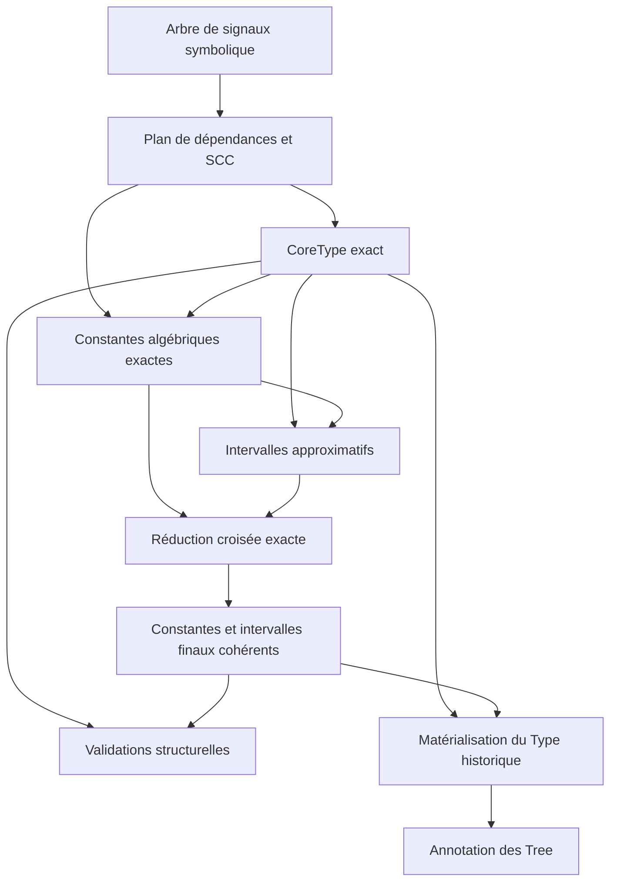

# Décomposition du typage Faust en calculs d’attributs

::: toc+
- **Objet** — définir la nouvelle architecture du typage et sa motivation.
- **Constat** — expliquer pourquoi le type historique est un domaine de point fixe trop grossier.
- **Principes** — fixer les règles de séparation, de précision et de compatibilité.
- **Domaines d’attributs** — distinguer le type structurel, les constantes exactes, les intervalles approximatifs et les validations.
- **Dépendances entre analyses** — ordonner les calculs et expliciter leurs interactions.
- **Évaluation des attributs** — partager le graphe tout en isolant convergence et invalidation.
- **Reconstruction du Type historique** — préserver l’API et les consommateurs existants.
- **API cible** — proposer les algèbres et les points d’entrée sans figer tous les détails.
- **Statut de SigTypeAlgebra** — repositionner le prototype existant dans la migration.
- **Migration** — introduire la nouvelle architecture par étapes réversibles.
- **Tests de conformité** — comparer les analyses, les types matérialisés et le comportement du compilateur.
- **Questions ouvertes** — recenser les propriétés qui doivent encore être vérifiées expérimentalement.
:::

## Objet

Cette spécification définit une architecture de remplacement progressif du système de typage des signaux Faust. Elle complète [la spécification du calcul bottom-up d’attributs](ATTRIBUTE-FIXPOINT-SPEC.md) en spécialisant ce mécanisme pour les différentes informations actuellement regroupées dans la classe `AudioType`.

La décision principale est de ne plus utiliser `Type` comme attribut unique du calcul de point fixe. Le nouveau système sépare les informations dont le point fixe est exact et atteint en un nombre fini d’étapes des informations, notamment les intervalles, qui peuvent nécessiter une approximation.

L’API historique reste disponible pendant toute la migration :

```cpp
void typeAnnotation(Tree signal, bool causality);
Type getSigType(Tree signal);
Type getCertifiedSigType(Tree signal);
```

`Type` devient un résultat matérialisé pour les consommateurs existants. Il n’est plus nécessairement le domaine interne utilisé par les analyses.

## Constat

### Hétérogénéité du type historique

Le type historique rassemble des informations de nature différente :

```adt
LegacyType ::= SimpleType(Nature, Variability, Computability,
                          Vectorability, Boolean, Interval, Resolution)
             | TableType(LegacyType)
             | TupleType(List(LegacyType))
```

Les composantes `Nature`, `Variability`, `Computability`, `Vectorability` et `Boolean` appartiennent à des domaines finis. Pour un graphe de signaux fixé, leur propagation monotone atteint nécessairement un point fixe exact après un nombre fini d’étapes.

Les intervalles suivent une dynamique différente. Une récurrence telle que :

```math
X = \mathrm{input} + 0.5 X
```

peut produire la suite :

```text
[-1, 1] ⊆ [-1.5, 1.5] ⊆ [-1.75, 1.75] ⊆ …
```

La nature réelle et la variabilité échantillon sont déjà stables pendant que les bornes continuent d’évoluer. Une égalité appliquée au `Type` complet considère pourtant chaque nouvel intervalle comme un changement de tout le type.

### Conséquences du produit monolithique

Utiliser le `Type` complet comme unité d’invalidation et de convergence entraîne :

- la réévaluation d’informations déjà exactes lorsqu’un intervalle change ;
- une granularité d’invalidation trop grossière dans les SCC récursives ;
- l’application indirecte de seuils ou d’élargissements à un produit contenant des composantes qui n’en ont pas besoin ;
- une difficulté à distinguer un résultat exact d’une approximation sûre ;
- un couplage entre propagation, approximation, validation de causalité et annotation des arbres.

::: important [Décision]
Les politiques de point fixe appartiennent aux domaines abstraits concernés. L’approximation des intervalles ne doit jamais invalider la précision ni la terminaison des attributs structurels exacts.
:::

## Principes

Le nouveau système respecte les principes suivants :

1. Une information sémantique ayant sa propre notion d’ordre, d’égalité ou de convergence peut devenir un attribut distinct.
2. Les domaines finis utilisent un véritable point fixe exact, sans budget ni élargissement.
3. Le domaine des intervalles porte explicitement ses bornes, son compteur et sa politique de résultat sûr.
4. Les analyses partagent le graphe structurel et les SCC, mais pas nécessairement leurs caches ni leurs files de travail.
5. Une modification d’intervalle ne marque pas le type structurel comme modifié.
6. Les dépendances entre analyses sont explicites et orientées ; elles ne passent pas par un état global implicite.
7. Les contrôles de validité sont séparés des fonctions de transfert lorsqu’ils ne contribuent pas au résultat abstrait.
8. Le `Type` historique est reconstruit après les analyses et annoté sur les arbres en une phase dédiée.

La séparation initiale comporte trois analyses principales : type structurel, constantes exactes et intervalles. Elle pourra être raffinée si les mesures justifient de distinguer davantage les composantes exactes.

## Domaines d’attributs

### Type structurel exact

Le premier domaine regroupe les informations finies qui partagent une convergence exacte :

```cpp
struct CoreType {
    Nature        nature;
    Variability   variability;
    Computability computability;
    Vectorability vectorability;
    Boolean       boolean;
    TypeShape     shape;
};
```

`TypeShape` distingue au minimum les valeurs scalaires, les tables et les tuples. La structure précise reste à définir afin de représenter le contenu des tables et de conserver la compatibilité avec les groupes non encore scalarisés.

Pour un graphe de signaux fixé, le domaine a une hauteur finie. Une SCC est stable lorsque toutes ses valeurs sont inchangées :

```cpp
bool reached(const CoreType& previous, const CoreType& current)
{
    return previous == current;
}
```

Cette analyse n’utilise ni élargissement, ni tolérance, ni limite arbitraire d’itérations. Un échec de terminaison révèle une erreur dans l’ordre abstrait, une fonction de transfert non monotone ou une représentation contenant une croissance non bornée ; il ne doit pas être masqué par une approximation.

### Constantes exactes

La propagation de constantes est une analyse distincte du calcul d’intervalles. Toute conclusion `Constant(v)` est exacte, mais l’analyse n’est pas supposée complète : elle peut produire `Top` pour un signal qui est en réalité constant. Son domaine minimal est :

```adt
ConstantAttribute ::= Bottom
                    | Constant(Value)
                    | Top
```

`Bottom` signifie qu’aucune information n’est encore disponible pendant le calcul du point fixe. `Constant(v)` certifie que le signal vaut exactement `v` à tout instant et autorise son remplacement par le littéral `v`. `Top` est l’élément abstrait maximal : l’analyse algébrique ne certifie aucune constante unique. Il ne constitue pas une preuve que le signal varie effectivement ; une analyse plus précise, notamment celle des intervalles, peut encore certifier une constante.

Le domaine ne contient pas de valeur `EventuallyConstant`. Une valeur qui n’est constante qu’après un transitoire ne peut pas être remplacée par un littéral sans changer la sémantique du signal pendant ce transitoire.

Les fonctions de transfert exploitent les identités exactes. En particulier, sous la sémantique arithmétique retenue par les simplifications Faust, zéro est absorbant pour la multiplication :

```text
multiply(Bottom, Constant(0)) = Constant(0)
multiply(Top, Constant(0))    = Constant(0)
```

Cette règle doit être assortie d’un contrat explicite sur les valeurs exceptionnelles. Si l’analyse modélise strictement `NaN` ou les infinis IEEE, l’identité doit être restreinte, car `0 * Inf` et `0 * NaN` ne valent pas zéro.

#### Récursion gardée et retards

En Faust, une dépendance récursive causale traverse un retard dont l’histoire initiale est nulle. Pour $n>0$ :

```math
X := X@n \quad\Longrightarrow\quad X = \mathbf{0}
```

En effet, les $n$ premiers échantillons valent zéro, puis chaque échantillon recopie un échantillon antérieur déjà nul. Ce résultat ne provient pas d’une initialisation arbitraire de toute récursion par `Constant(0)` : il provient de la sémantique exacte du retard.

La propriété s’étend à toute expression dont zéro est un point fixe :

```math
X := F(X@n),\quad n>0,\quad F(0)=0
\quad\Longrightarrow\quad X = \mathbf{0}
```

Le cas important suivant est donc exact pour tout signal `Y` défini :

```math
\forall Y,\quad X := Y\,(X@n),\quad n>0
\quad\Longrightarrow\quad \operatorname{Constant}(0)
```

Le calcul doit distinguer les dépendances instantanées des dépendances retardées et injecter l’histoire initiale nulle au niveau de ces dernières. La causalité gardée assure alors l’unicité de la solution temporelle. Une équation non gardée comme `X := X` ne bénéficie pas de cette conclusion.

Le retard d’une constante illustre la prise en compte du transitoire :

```text
delay(Constant(0), n) = Constant(0)   si n > 0
delay(Constant(c), n) = Top           si n > 0 et c != 0
```

La seconde règle reflète la suite composée de $n$ zéros puis de la valeur $c$ ; elle justifie l’absence de `EventuallyConstant` dans le domaine utile à la substitution.

#### Équivalence sémantique et précision algorithmique

Au niveau sémantique, constance et intervalle singleton décrivent exactement la même propriété. Si `Range(X)` est l’ensemble de toutes les valeurs prises par `X` à tous les instants :

```math
X=\operatorname{Constant}(c)
\quad\Longleftrightarrow\quad
\operatorname{Range}(X)=\{c\}
\quad\Longleftrightarrow\quad
\operatorname{Interval}(X)=[c,c]
```

Cette équivalence sémantique n’implique pas que deux analyses abstraites indépendantes possèdent toujours la même précision. Une analyse d’intervalles non relationnelle peut, par exemple, calculer `[-2,2]` pour `Y-Y` lorsque `Y` est dans `[-1,1]`, alors qu’une règle algébrique tenant compte du partage reconnaît exactement zéro. Inversement, les bornes d’un slider peuvent former un singleton que l’analyse algébrique ne reconnaît pas encore.

Les conclusions positives des deux analyses restent exactes : `Constant(c)` prouve la constance, et une borne extérieure sûre `[c,c]` la prouve également. En revanche, `Top` ou un intervalle extérieur non singleton expriment une perte de précision et ne prouvent pas que le signal varie. Une preuve de variation demanderait une information supplémentaire, par exemple deux valeurs atteignables distinctes fournies par une approximation intérieure.

Une constante exacte alimente naturellement l’analyse d’intervalles : `Constant(c)` implique l’intervalle exact `[c,c]`. Réciproquement, un intervalle extérieur sûr réduit à `[c,c]` certifie que le signal vaut `c` à tout instant. Cette conclusion découle directement du contrat de l’analyse : si $R$ est l’ensemble de toutes les valeurs effectivement prises par le signal et si $R \subseteq [c,c]$, alors $R=\{c\}$.

Pour l’encadrement `(lower, upper, iteration)` :

- `upper == [c,c]` suffit à certifier `Constant(c)` ;
- `lower == [c,c]` ne suffit pas si `upper` est plus large ;
- `lower == upper == [c,c]` constitue naturellement le cas exact complet.

Cette certification ne rend pas inutile l’analyse directe des constantes. Celle-ci peut détecter rapidement des identités algébriques ou récursives, puis fournir des singletons au calcul d’intervalles. Après ce calcul, une réduction croisée, au sens d’un produit réduit de domaines abstraits, combine les deux résultats : une constante algébrique réduit l’intervalle final au singleton correspondant, tandis qu’une borne extérieure singleton complète les constantes certifiées.

### Intervalles approximatifs

Le domaine des intervalles décrit les valeurs numériques possibles. Dans une SCC récursive, l’attribut est un encadrement :

```cpp
struct IntervalApproximation {
    interval    lower;
    interval    upper;
    std::size_t iteration;
};
```

Si $R$ est l’intervalle recherché, l’invariant est :

```math
\mathrm{lower} \subseteq R \subseteq \mathrm{upper}
```

Le point fixe est accepté dans l’un des cas suivants :

- `lower == upper`, auquel cas le résultat est exact ;
- le budget porté par l’attribut est épuisé, auquel cas `upper` fournit le résultat sûr.

Une première version peut porter un compteur par attribut. Une version ultérieure pourra distinguer l’âge des bornes inférieure et supérieure si cela améliore la précision sans réintroduire la politique historique dans le moteur générique.

Les fonctions de transfert doivent préserver l’inclusion. Cette obligation doit être vérifiée pour les casts, divisions, décalages, tables, primitives étendues et opérations dont le domaine comporte des valeurs non bornées ou invalides.

### Résolution numérique

La résolution `res` ne fait pas partie du noyau exact tant que sa valeur dépend de l’intervalle ou évolue avec lui. Deux options restent compatibles avec la présente architecture :

- la dériver de l’intervalle final lors de la matérialisation du `Type` ;
- lui donner une analyse dédiée si elle possède des règles indépendantes utiles au compilateur.

Elle ne doit pas empêcher la convergence de `CoreType`.

### Validations

Les vérifications qui consomment des types ou des bornes sans produire ces attributs deviennent des passes séparées. Cela concerne notamment :

- la causalité des délais ;
- la validité et la positivité des indices de délai ;
- les bornes des parties de fichiers sonores ;
- la cohérence des projections et des groupes récursifs ;
- les préconditions de certaines primitives ou tables.

Une validation s’exécute sur des résultats publiés. Elle ne modifie pas silencieusement l’attribut qu’elle vérifie.

## Dépendances entre analyses

L’ordre initial est le suivant :



L’analyse algébrique des constantes peut consulter `CoreType` comme contexte immuable afin de respecter la nature entière ou réelle des opérations. L’analyse des intervalles peut consulter `CoreType` et ces constantes exactes. Une phase de réduction finale combine ensuite les constantes algébriques et les intervalles extérieurs singleton. Les exemples connus comprennent :

- `IntCast`, qui transforme les bornes selon une sémantique entière ;
- `Div`, dont le résultat structurel est réel même pour deux arguments entiers ;
- les tables, dont la forme et le contenu sont déterminés structurellement ;
- les primitives étrangères ou étendues dont la nature numérique est déclarée séparément.

Les deux sens constante vers intervalle et intervalle vers constante sont autorisés dans cette réduction exacte. Ils ne provoquent pas une nouvelle exécution des calculs de point fixe. Le sens intervalle vers type structurel doit être évité. Les règles historiques qui semblent l’exiger doivent être classées soit comme dérivation tardive, soit comme validation. Toute autre dépendance circulaire entre domaines doit être documentée et traitée explicitement, sans fusionner de nouveau les politiques globales de convergence.

## Évaluation des attributs

### Plan structurel partagé

Le résolveur de dépendances construit un plan commun contenant :

- les nœuds d’analyse correspondant aux expressions et projections récursives ;
- les arêtes de dépendance ;
- les composantes fortement connexes ;
- le DAG condensé ;
- les dépendants immédiats ;
- un ordre d’évaluation déterministe.

Le plan peut être réutilisé par plusieurs analyses tant que la structure de l’arbre ne change pas. La transformation `sigScalarize` simplifie les groupes en groupes singletons mais ne supprime pas les SCC mutuellement récursives.

### Caches et invalidation séparés

Chaque analyse possède sa table :

```cpp
std::map<SignalAttributeNode, CoreType> coreTypes;
std::map<SignalAttributeNode, ConstantAttribute> algebraicConstants;
std::map<SignalAttributeNode, IntervalApproximation> intervals;
std::map<SignalAttributeNode, ConstantAttribute> certifiedConstants;
std::map<SignalAttributeNode, IntervalResult> reducedIntervals;
```

Une transition dans `intervals` ne remet dans sa file que les consommateurs d’intervalles concernés. Elle ne réévalue ni `coreTypes` ni `algebraicConstants`, déjà stables. Après convergence, une passe linéaire construit `certifiedConstants` et `reducedIntervals` selon les règles suivantes :

```text
Constant(c), intervalle contenant c  -> Constant(c), [c,c]
Bottom ou Top, upper == [c,c]        -> Constant(c), [c,c]
autre cas                            -> constante inchangée, intervalle inchangé
```

Si une constante algébrique n’appartient pas à l’intervalle calculé, ou si les deux voies certifient des valeurs différentes, l’analyse signale une violation de cohérence au lieu de choisir arbitrairement l’une d’elles. Pour tout résultat final valide, la réduction garantit :

```math
\operatorname{constant}=\operatorname{Constant}(c)
\quad\Longleftrightarrow\quad
\operatorname{interval}=[c,c]
```

Une implémentation pourra plus tard co-ordonnancer plusieurs attributs pour réduire les parcours. Cette optimisation devra conserver des marqueurs de changement distincts par domaine. La séparation sémantique ne dépend pas du nombre physique de boucles d’évaluation.

### Point fixe exact

Dans une SCC de `CoreType`, l’algorithme part de l’élément minimal approprié, applique les fonctions de transfert et propage uniquement les changements exacts. La terminaison résulte de la hauteur finie du domaine et de la monotonie.

L’analyse des constantes utilise elle aussi un domaine de hauteur finie et un point fixe exact. Pour une SCC récursive gardée, l’état initial de chaque arête retardée est `Constant(0)`, tandis qu’une information ordinaire encore inconnue reste `Bottom`. Le moteur ne doit pas confondre ces deux origines.

### Point fixe d’intervalle

Dans une SCC d’intervalles, l’algorithme calcule simultanément les approximations intérieure et extérieure. Le prédicat de fin appartient à `IntervalApproximation`. Le moteur bottom-up ne contient aucune opération appelée `stabilize` et ne connaît pas la signification du compteur.

Le rapport d’évaluation distingue au minimum :

- convergence exacte ;
- résultat extérieur choisi par épuisement du budget ;
- violation d’un invariant d’inclusion ;
- opération non monotone ou non prise en charge ;
- budget global de sécurité dépassé à cause d’un défaut d’implémentation.

## Reconstruction du Type historique

La matérialisation combine les résultats sans relancer les analyses :

```cpp
Type materializeType(const CoreType& core, const IntervalResult& range);
```

Pour chaque nœud utile :

```cpp
for (const auto& node : plan.nodes()) {
    Type type = materializeType(coreTypes.at(node), finalRange(intervals.at(node)));
    setSigType(node.tree, type);
}
```

La matérialisation est responsable de la construction des `SimpleType`, `TableType` et `TupletType`, ainsi que de la résolution dérivée si elle reste stockée dans `AudioType`.

Les propriétés TLIB ne servent plus de mémoire de travail. Elles reçoivent seulement le résultat final destiné aux consommateurs historiques.

La compatibilité impose que les fonctions suivantes conservent leur contrat :

```cpp
typeAnnotation(signal, causality);
getSigType(signal);
getCertifiedSigType(signal);
setSigType(signal, type);
```

Dans la nouvelle implémentation, `typeAnnotation` orchestre les analyses, les validations demandées et la matérialisation.

## API cible

Les noms suivants expriment l’intention sans figer la forme finale des classes :

```cpp
FaustAlgebra<CoreType>& sigCoreTypeAlgebra();
FaustAlgebra<ConstantAttribute>& sigConstantAlgebra();
FaustAlgebra<IntervalApproximation>& sigIntervalAlgebra();

struct ReducedNumericAttribute {
    ConstantAttribute constant;
    IntervalResult    interval;
};

ReducedNumericAttribute reduceNumericAttributes(
    const ConstantAttribute& algebraic,
    const IntervalResult& interval);

TypeAnalysisResult inferSignalAttributes(Tree signal);
void materializeSignalTypes(const TypeAnalysisResult& result);
void validateSignalTypes(Tree signal, const TypeAnalysisResult& result,
                         bool causality);
```

Les fichiers envisagés sont :

```tree
signals
  sigCoreTypeAlgebra.hh
  sigCoreTypeAlgebra.cpp
  sigConstantAlgebra.hh
  sigConstantAlgebra.cpp
  sigIntervalAlgebra.hh
  sigIntervalAlgebra.cpp
  sigTypeMaterialization.hh
  sigTypeMaterialization.cpp
  bottom-up-attributes.hh
```

`itv::interval_algebra` reste l’algèbre des opérations primitives sur les intervalles. `sigIntervalAlgebra` ajoute la sémantique propre aux constructeurs de signaux : entrées, interfaces utilisateur, délais, tables, fichiers sonores et primitives étendues.

L’ancien `FixPointUpdate` de `FaustAlgebra` n’est pas utilisé par ces analyses. Il peut être conservé temporairement pour la compatibilité de l’interface, puis déprécié séparément.

## Statut de SigTypeAlgebra

Le prototype `sigTypeAlgebra.hh/.cpp`, dont le porteur était `Type`, a permis de vérifier que des règles locales peuvent être exprimées sous forme de `FaustAlgebra` et comparées au moteur historique.

Il a été retiré après cette validation, car il reproduisait le produit monolithique identifié dans cette spécification. Le conserver ou compléter ses opérations `unsupported` aurait créé une seconde implémentation provisoire du typeur historique, puis imposé une nouvelle redistribution de ses règles.

Le premier porteur cible `CoreType` et le point d’entrée `sigCoreTypeAlgebra()` les remplacent. Leur premier jalon couvre les constantes scalaires, entrées, sorties, interfaces utilisateur de base, casts, opérations binaires, sélection et retards simples. Les tests comparent uniquement les composantes structurelles au typeur historique ; aucun intervalle n’entre dans `CoreType`.

Les opérations de `sigCoreTypeAlgebra` qui ne sont pas encore migrées échouent explicitement. Cette incomplétude est transitoire mais porte désormais sur l’architecture définitive, et non sur un porteur destiné à disparaître.

## Migration

### Étape 1 — figer l’observation

- définir une égalité structurelle complète des `Type` historiques ;
- enregistrer les types de tous les sous-signaux d’un corpus représentatif ;
- distinguer dans les rapports les différences structurelles, d’intervalle et de résolution.

### Étape 2 — introduire CoreType

- porter les constantes, entrées, sorties, casts et opérations binaires ;
- ajouter les interfaces utilisateur et les délais non récursifs ;
- vérifier l’égalité avec les composantes correspondantes du type historique ;
- ne matérialiser aucun `Type` dans le chemin de production.

### Étape 3 — calculer les points fixes exacts

- appliquer `CoreType` aux SCC récursives ;
- vérifier la terminaison sans budget ;
- comparer les résultats sur groupes historiques et groupes scalarisés ;
- diagnostiquer toute fonction de transfert non monotone.

### Étape 4 — introduire les constantes exactes

- porter les fonctions de transfert non récursives et leurs identités exactes ;
- distinguer `Bottom`, `Constant(v)` et `Top` ;
- modéliser l’histoire nulle des retards sans initialiser arbitrairement les autres inconnues à zéro ;
- tester `X := X@n`, `X := Y*(X@n)` et la propriété générale `F(0)=0` ;
- comparer les substitutions obtenues à la propagation de constantes historique.

### Étape 5 — introduire les intervalles

- définir les bornes initiales intérieure et extérieure ;
- porter les fonctions de transfert numériques ;
- intégrer le compteur et la sélection sûre de la borne extérieure ;
- réduire le couple final dans les deux sens entre `Constant(c)` et `[c,c]` ;
- comparer précision, terminaison et performances au système historique.

### Étape 6 — matérialiser et comparer

- reconstruire les `Type` historiques ;
- exécuter ancien et nouveau moteurs en mode comparatif ;
- conserver les annotations historiques tant qu’une divergence non expliquée subsiste.

### Étape 7 — activer progressivement

- activer le nouveau moteur dans la bibliothèque autonome ;
- synchroniser les fichiers dans Faust ;
- tester le code généré, les réponses impulsionnelles et les exemples coûteux ;
- garder temporairement un mécanisme de retour au moteur historique.

### Étape 8 — retirer l’ancien moteur

Le retrait n’est autorisé qu’après disparition ou justification explicite des divergences, stabilité des performances et validation de tous les consommateurs de `Type`.

## Tests de conformité

### Type structurel

- constantes entières et réelles ;
- promotions mixtes ;
- variabilité, calculabilité, vectorisabilité et booléens ;
- tables, tuples et primitives étendues ;
- SCC simples et mutuellement récursives ;
- équivalence avant et après scalarisation.

### Intervalles

- convergence exacte en un nombre fini d’étapes ;
- convergence asymptotique avec encadrement ;
- division par un intervalle contenant zéro ;
- casts entiers et opérations de bits ;
- bornes infinies, invalides ou vides ;
- choix sûr de `upper` lorsque le budget est atteint ;
- conservation systématique de `lower ⊆ résultat ⊆ upper`.

### Constantes exactes

- propagation des constantes entières et réelles dans les opérations pures ;
- absorption par zéro, y compris lorsque l’autre opérande est `Bottom` ou `Top` ;
- `X := X@n` reconnu comme `Constant(0)` pour $n>0$ ;
- `X := Y*(X@n)` reconnu comme `Constant(0)` pour plusieurs formes de `Y` ;
- `X := 1 + X@n` et le retard d’une constante non nulle classés `Top` ;
- absence de conclusion `Constant` pour une récursion non gardée ;
- production de `[c,c]` depuis `Constant(c)` ;
- certification de `Constant(c)` depuis une borne extérieure sûre `[c,c]` ;
- réduction de l’intervalle final à `[c,c]` depuis une constante algébrique `Constant(c)` ;
- absence de certification depuis la seule borne intérieure `[c,c]` lorsque la borne extérieure est plus large ;
- détection d’une incohérence si les voies algébrique et intervalle certifient deux valeurs différentes ;
- comportement documenté pour `NaN`, les infinis et les zéros signés.

### Invalidation

Un test récursif doit montrer qu’une évolution d’intervalle :

- réévalue seulement les nœuds nécessaires de l’analyse d’intervalles ;
- ne réévalue pas `CoreType` après sa convergence ;
- ne réévalue pas les constantes exactes après leur convergence ;
- ne modifie pas les composantes structurelles déjà publiées.

### Compatibilité

- comparaison par sous-signal entre ancien et nouveau `Type` ;
- absence de changement d’API pour les consommateurs ;
- code généré identique lorsque les versions de référence sont comparables ;
- réponses impulsionnelles identiques ;
- absence de régression significative du temps de compilation et de la mémoire.

## Questions ouvertes

1. `TypeShape` doit-il contenir récursivement les formes des tables et tuples, ou ces formes doivent-elles être des attributs séparés ?
2. La résolution doit-elle être dérivée de l’intervalle final ou calculée par une troisième algèbre ?
3. Toutes les fonctions de transfert d’intervalles utilisées par Faust sont-elles monotones pour l’ordre par inclusion choisi ?
4. Certaines règles historiques font-elles réellement dépendre une composante de `CoreType` d’une borne numérique, hors validation ?
5. Faut-il un compteur par nœud, par borne ou par SCC pour les intervalles ?
6. Le même plan de dépendances suffit-il pour toutes les analyses, ou certaines primitives introduisent-elles des dépendances propres à un attribut ?
7. Quand la scalarisation doit-elle entrer dans la chaîne afin de simplifier les tuples récursifs sans compliquer la comparaison avec le moteur historique ?
8. Le contrat arithmétique de l’analyse des constantes exclut-il `NaN` et les infinis, ou le domaine doit-il les représenter explicitement ?
9. Les retards de longueur non constante nécessitent-ils une information d’initialisation plus riche que le cas statique $n>0$ ?

Ces questions n’empêchent pas le premier jalon, maintenant engagé : étendre progressivement `CoreType` tout en comparant ses composantes exactes au type historique, sans calculer encore les intervalles.
